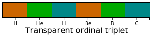

# chromabar

[](https://travis-ci.org/vidartf/chromabar)
[](https://codecov.io/gh/vidartf/chromabar)

A JavaScript library for rendering color bars. Based on d3-scales and SVG.
Also includes components for a color map editor.

## Installation

To use the package as a library, install it with:

```bash
npm install --save chromabar
```

For development, clone the repository and run:

```bash
npm install     # To install dependencies
npm run build   # To compile the typescript sources
npm test        # To run tests
```

## Screenshots

Here are some examples of use, as output by the demo:




## API

TODO
